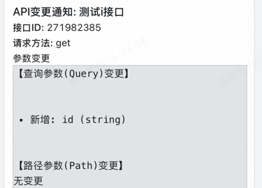

# API-Pulse

API-Pulse 是一个 API 变更监控和通知工具，专为 Apifox 设计，用于实时跟踪 API 变更并发送钉钉通知。




## 功能特点

- 自动初始化并存储所有 API 信息
- 接收 Apifox 的 webhook 回调，检测 API 变更
- 对比 API 的变更，包括路径、请求体、参数和响应
- 将变更信息推送到钉钉群聊

## 技术栈

- 使用 Go 语言开发
- 直接调用钉钉 webhook URL 发送通知

## 快速开始

### 1. 配置文件

首先，复制示例配置文件并填写您的配置：

```bash
cp config/config.yaml config/config.local.yaml
```

编辑 `config/config.local.yaml` 文件，填写以下配置：

```yaml
server:
  port: 8080  # 服务监听端口

apifox:
  project_id: "你的项目ID"
  branch_id: "你的分支ID"
  authorization: "你的授权token"
  base_url: "https://api.apifox.com/api/v1"
  responsible_id: "负责人id"

dingtalk:
  webhook_url: "钉钉机器人的 webhook URL"
```

### 2. 启动服务

```bash
go build -o apipulse ./cmd/apipulse
./apipulse --config=config/config.local.yaml
```

## 使用指南
1.在网页 apifox 中的接口找到 project_id,branch_id,authorization，可以查看图中请求，在请求头中找到


2.responsible_id 值可以通过保存一次请求后，在响应结果中搜到

3.在钉钉的机器人中配置关键字：API创建通知、API变更通知

## 流程
通过 apifox 配置的 webhook 到本项目，以及配置好的负责人id，将和你对接的人拉到钉钉群，添加一个机器人，推送进来即可


## QA

**Q:为什么不用原生 apifox 的 webhook**

A:原生只通知了接口变更，其他什么信息都没有，没有用

**Q：负责人有什么用？**

A：如果是直接推到群里的话，数据太脏，没有办法知道哪个接口的连调人，并且一般连调是固定的，只有前端看文档，因此拉上对应的人到群里给他们推就行


